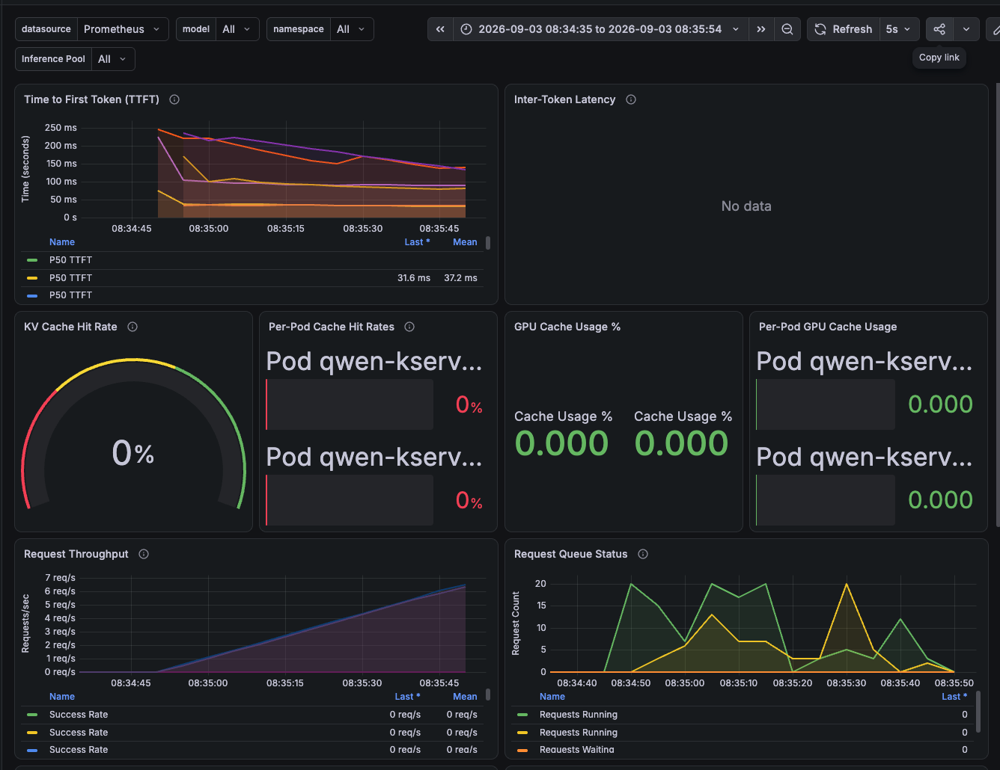
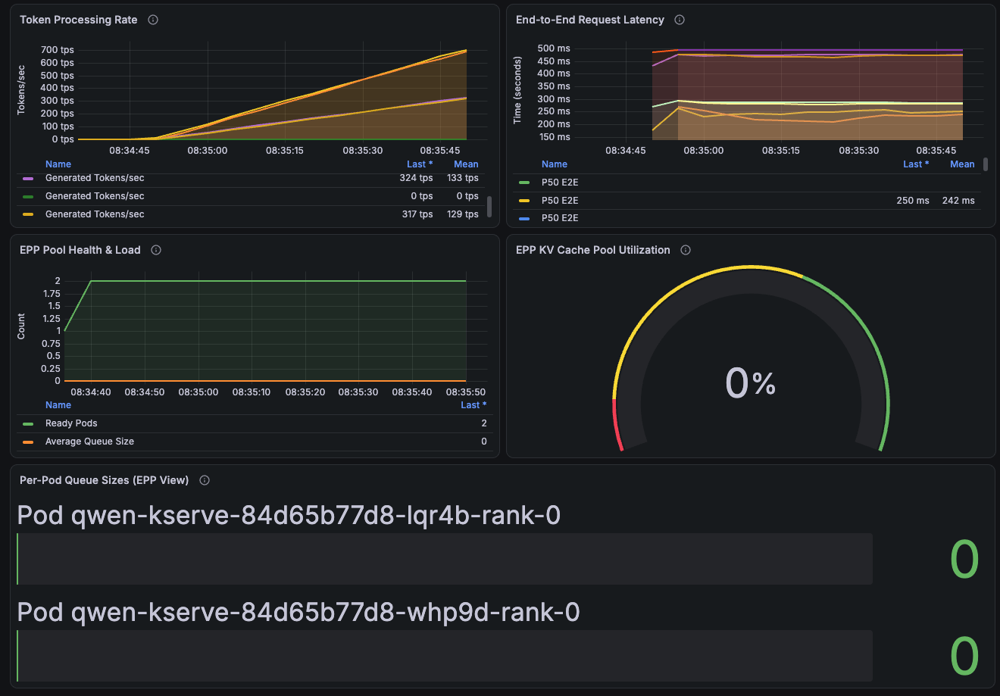

# Test 00 — Baseline Results

**Status:** PASS  
**Date:** 2026-09-03  
**Scenario:** `00-baseline`  
**Model:** Qwen/Qwen3-0.6B  
**Replicas:** 2  
**Gateway:** `https://inference-gateway.REPLACE_WITH_CLUSTER_APPS_DOMAIN/demo-llm/qwen`

## Summary

Baseline throughput test completed successfully under random synthetic traffic (no shared prefixes). GuideLLM drove 3,814 successful requests at concurrency 20 over a 60-second measurement window with **0% errors**. Both `qwen` pods were active, EPP reported 2 ready pods with no queue buildup, and KV cache hit rate stayed at 0% — all consistent with the TESTPLAN expectations for a no-prefix baseline.

## Test Configuration

| Parameter | Value |
|---|---|
| GuideLLM profile | `throughput`, max_concurrency=20 |
| Duration | 60 seconds (`max_duration` constraint) |
| Data | `synthetic_text`, 100 prompt / 50 output tokens |
| Prefix buckets | None (random traffic) |
| EPP plugins | precise-prefix-cache-scorer (3), queue-scorer (2), kv-cache-utilization-scorer (2) |

Source: `guidellm-job.yaml`, `benchmark.csv` run metadata.

## Run Window

From `run-metadata.txt`:

| | Timestamp (UTC) |
|---|---|
| Job start | 2026-09-03T15:34:35Z |
| Job end | 2026-09-03T15:35:54Z |
| GuideLLM measure window | 2026-09-03T15:34:48Z → 15:35:48Z (60 s) |
| Results collected | 2026-09-03T15:36:01Z |
| Job pod | `guidellm-00-baseline-lq294` |
| Namespace | `demo-llm` |

Grafana screenshots use local time **08:34:35 → 08:35:54** (UTC−7), matching the job window above.

## GuideLLM Results

From `benchmark.csv` summary row:

| Metric | Value |
|---|---|
| Requests successful | 3,814 |
| Requests incomplete | 18 (stopped at max_duration) |
| Requests errored | 0 |
| Error rate | 0% |
| Throughput (RPS) | 63.5 req/s (mean) |
| Concurrency | 20 (median) |
| TTFT p50 | 63 ms |
| TTFT mean | 67 ms |
| ITL p50 | 5.0 ms |
| ITL mean | 5.0 ms |
| E2E latency mean | 313 ms |
| Input tokens / request | 108 (mean) |
| Output tokens / request | 50 (mean) |
| Input tokens/s | 6,919 |
| Output tokens/s | 3,190 |
| Total tokens/s | 10,081 |

**Note:** Warm vs cold TTFT is N/A for this scenario — there are no shared prefix buckets, so every prompt is unique.

## Grafana Observations

Time range: 2026-09-03 08:34:35 → 08:35:54 (local)

| Panel | Observation |
|---|---|
| TTFT P50 | ~32 ms (server-side); stabilizes after initial ramp |
| Inter-Token Latency | No data (dashboard panel empty for this run) |
| KV Cache Hit Rate | 0% — expected (no shared prefixes) |
| Per-Pod Cache Hit Rates | 0% on both pods |
| GPU Cache Usage | ~0% — short prompts on small model |
| Request Throughput | Ramps to ~6–7 req/s per series as concurrency fills |
| Request Queue | Running peaks at 20; waiting stays at 0 |
| EPP Ready Pods | 2 (`qwen-kserve-84d65b77d8-lqr4b-rank-0`, `...-whp9d-rank-0`) |
| EPP Queue Size | 0 on both pods |
| EPP KV Cache Utilization | 0% |
| Token Processing Rate | ~324 tps + ~317 tps at peak (both pods active) |
| E2E Latency P50 | ~242–250 ms |

### Grafana Screenshots

**Page 1** — TTFT, inter-token latency, KV cache hit rate, GPU cache usage, request throughput, request queue status



**Page 2** — Token processing rate, end-to-end latency, EPP pool health, KV cache utilization, per-pod queue sizes



## TESTPLAN Validation

Per [TESTPLAN.md](../../TESTPLAN.md) — Test 00 Baseline Throughput:

| TESTPLAN expected result | Evidence | Result |
|---|---|---|
| Gateway returns HTTP 200 | Smoke test passed before benchmark; 0 errored requests in `benchmark.csv` | **PASS** |
| GuideLLM error rate < 1% | 0 / 3,832 requests errored (0%) | **PASS** |
| Both `qwen` pods receive traffic | Grafana token processing ~324 tps on one pod, ~317 tps on the other; both pods listed in per-pod panels | **PASS** |
| `up{job="llm-d-epp-metrics"} == 1` | EPP Pool Health shows 2 ready pods throughout run; per-pod queue and cache panels populated | **PASS** (inferred) |
| No `EPPNoReadyPods` alert | EPP ready count stable at 2; no queue buildup or pod loss observed | **PASS** (inferred) |
| Benchmark completes | Job finished; `benchmark.json`, `benchmark.csv`, `benchmark.log` collected (`files_copied=2` in run-metadata) | **PASS** |
| Baseline metrics recorded | Full summary in `benchmark.csv` / `benchmark.json` | **PASS** |

**Overall: PASS**

## Results Template (from TESTPLAN)

```
Test ID:           00-baseline
Date / Cluster:    2026-09-03 / REPLACE_WITH_CLUSTER_APPS_DOMAIN
Gateway URL:       https://inference-gateway.REPLACE_WITH_CLUSTER_APPS_DOMAIN/demo-llm/qwen
Duration:          60 s (measure window)

GuideLLM Results:
  - TTFT p50 (cold):  N/A (no prefix buckets)
  - TTFT p50 (warm):  N/A (no prefix buckets)
  - ITL p50:          5.0 ms
  - RPS:              63.5
  - Error rate:       0%

Prometheus/Grafana:
  - KV cache hit rate peak:  0%
  - EPP pool ready pods:     2
  - Alerts fired:            none observed

PASS / FAIL:  PASS
Notes:        0% KV hit rate and balanced token throughput across both pods
              confirm random traffic with no prefix affinity. Use these metrics
              as the reference for Tests 01a, 01b, 01c, and 04a.
```

## Interpretation

This baseline establishes reference performance for random synthetic traffic with no prefix affinity:

- **Throughput:** ~63.5 req/s at concurrency 20 is the reference RPS for later scaling comparisons (e.g. Test 04a expects ~1.5–2×).
- **Latency:** TTFT p50 ~63 ms (client) / ~32 ms (server-side Grafana) and E2E p50 ~242–250 ms set the latency floor.
- **Cache:** 0% KV hit rate is expected — the precise-prefix-cache scorer has nothing to route on without shared prefixes.
- **Load balancing:** Both replicas are active with no EPP queue buildup, indicating the stack handles concurrency 20 comfortably on 2 GPUs.

## Comparison Reference

Use these values when evaluating later tests:

| Test | Expected change vs baseline |
|---|---|
| 01a Prefix-cache | TTFT drops on warm prefixes; KV hit rate > 0%; one pod dominates cache |
| 01b Queue/KV spillover | Queues on both pods under concurrency=80; secondary pod cache rises |
| 01c Round-robin control | Higher TTFT, lower cache hit rate than 01a |
| 04a Data parallelism (4 rep) | ~1.5–2× throughput vs 63.5 req/s |

## Artifacts

| File | Description |
|---|---|
| `benchmark.json` | Full GuideLLM run data (gitignored — large) |
| `benchmark.csv` | Summary statistics |
| `benchmark.log` | GuideLLM console output (gitignored — large) |
| `run-metadata.txt` | Collection metadata and time window |
| `graphana-page1.png` | Grafana: TTFT, cache, throughput, queues |
| `grafana-page2.png` | Grafana: tokens, E2E latency, EPP health |
