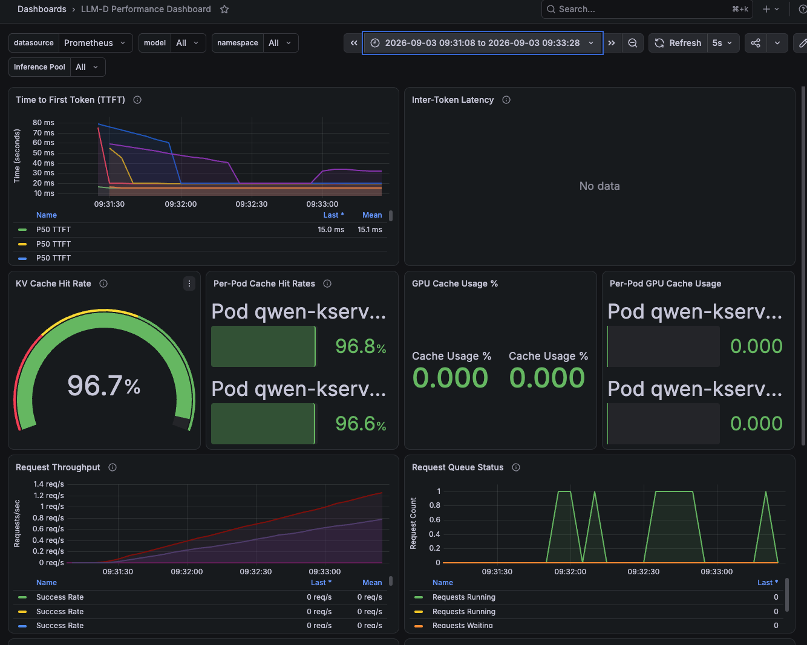
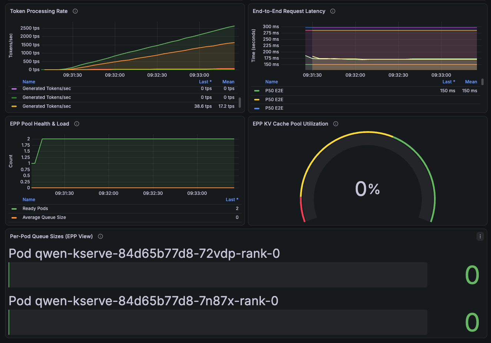

# Test 01a — Prefix-Cache Aware Routing Results

**Status:** FAIL (partial — prefix caching works; routing affinity and EPP KV metrics do not fully meet criteria)  
**Date:** 2026-09-03  
**Scenario:** `01a-prefix-cache-routing`  
**Model:** Qwen/Qwen3-0.6B  
**Replicas:** 2  
**Gateway:** `https://inference-gateway.apps.cluster-nqcv7.nqcv7.sandbox340.opentlc.com/demo-llm/qwen`

## Summary

Prefix-cache aware routing test completed with **600 successful requests at 5 req/s** over 120 seconds, all sharing a single 2048-token prefix. GuideLLM reported **0% errors**. Grafana shows a **96.7% KV cache hit rate** and a sharp server-side TTFT drop from ~75 ms (cold) to ~15 ms (warm) within the first 30 seconds — confirming prefix caching is effective. However, traffic was split roughly **63% / 37%** across the two pods (not the expected >70% dominance on one pod), both replicas reported similarly high per-pod hit rates (~96.8% / 96.6%), and **EPP KV Cache Pool Utilization** remained at 0% throughout the run.

## Test Configuration

| Parameter | Value |
|---|---|
| GuideLLM profile | `constant`, rate=5 req/s |
| Duration | 120 seconds (`max_duration` constraint) |
| Data | `synthetic_text`, 50 prompt / 50 output tokens |
| Prefix buckets | 1 shared prefix × 2048 tokens (100% weight) |
| EPP plugins | precise-prefix-cache-scorer (3), queue-scorer (2), kv-cache-utilization-scorer (2) |

Source: `guidellm-job.yaml`, `llminferenceservice.yaml`, `benchmark.csv` run metadata.

## Run Window

From `run-metadata.txt`:

| | Timestamp (UTC) |
|---|---|
| Collection window start | 2026-09-03T16:31:08Z |
| Collection window end | 2026-09-03T16:33:28Z |
| GuideLLM measure window | 2026-09-03T16:31:22Z → 16:33:22Z (120 s) |
| Results collected | 2026-09-03T16:33:32Z |
| Job pod | `guidellm-01a-prefix-cache-p7jnn` |
| Namespace | `demo-llm` |

Grafana screenshots use local time **09:31:08 → 09:33:28** (UTC−7), matching the collection window above.

## GuideLLM Results

From `benchmark.csv` summary row and per-request data in `benchmark.json`:

| Metric | Value |
|---|---|
| Requests successful | 600 |
| Requests incomplete | 0 |
| Requests errored | 0 |
| Error rate | 0% |
| Throughput (RPS) | 5.0 req/s (mean, as configured) |
| Concurrency | 1.0 (median) |
| TTFT p50 (all) | 51.0 ms |
| TTFT mean | 51.0 ms |
| TTFOT p50 | 33.4 ms |
| TTFOT mean | 34.1 ms |
| ITL p50 | 3.8 ms |
| ITL mean | 3.8 ms |
| E2E latency mean | 191 ms |
| Input tokens / request | 2,111 (mean — 2048 prefix + ~63 unique) |
| Output tokens / request | 50 (mean) |
| Input tokens/s | 10,580 |
| Output tokens/s | 250 |
| Total tokens/s | 10,830 |

### Cold vs Warm TTFT (per-request analysis)

Derived from `benchmark.json` `time_to_first_token_ms` on successful requests:

| Segment | TTFT p50 | Notes |
|---|---|---|
| Cold (first 5 requests) | 42.7 ms | First request peaked at 118.8 ms |
| Warm (requests 6+) | 33.4 ms | Stabilized by request 6 |
| Warm (requests 51+) | 33.4 ms | Steady-state |
| Client speedup (cold → warm) | **1.3×** | Does not meet 5× pass criterion |
| Warm as % of cold | 78.2% | Does not meet <20% criterion |

**Note:** Client-side TTFT includes gateway and network overhead on 2,111-token prompts. Server-side Grafana TTFT (below) shows a much larger cold→warm improvement because it measures inference-side latency directly.

## Grafana Observations

Time range: 2026-09-03 09:31:08 → 09:33:28 (local)

| Panel | Observation |
|---|---|
| TTFT P50 | Starts ~70–80 ms (cold), drops sharply to ~15 ms by 09:31:45 (warm) |
| Inter-Token Latency | No data (dashboard panel empty for this run) |
| KV Cache Hit Rate | **96.7%** — prefix caching is highly effective |
| Per-Pod Cache Hit Rates | 96.8% and 96.6% — both pods cache hits, not one-sided dominance |
| GPU Cache Usage | 0% on both pods — metric may not be exposed for this model/config |
| Request Throughput | Ramps linearly to ~1.2 req/s per series at rate=5 |
| Request Queue | Intermittent spikes to 1; running/waiting both 0 at end |
| Token Processing Rate | ~2,500 tps on one pod, ~1,500 tps on the other (~63% / 37% split) |
| E2E Latency P50 | ~150 ms |
| EPP Ready Pods | 2 (stable throughout) |
| EPP Queue Size | 0 on both pods |
| EPP KV Cache Pool Utilization | **0%** — did not rise during the run |

### Grafana Screenshots

**Page 1** — TTFT, inter-token latency, KV cache hit rate, GPU cache usage, request throughput, request queue status



**Page 2** — Token processing rate, end-to-end latency, EPP pool health, KV cache utilization, per-pod queue sizes



## TESTPLAN Validation

Per [TESTPLAN.md](../../TESTPLAN.md) — Test 01a Prefix-Cache Aware Routing:

| TESTPLAN expected result | Evidence | Result |
|---|---|---|
| TTFT p50 (warm) < 20% of TTFT p50 (cold) | Grafana: ~15 ms / ~75 ms = **20%** (borderline). GuideLLM client: 33.4 / 42.7 = **78%** | **PASS** (server) / **FAIL** (client) |
| Warm-prefix TTFT ≥ 5× faster than cold-start | Grafana server: ~75 / ~15 = **5×**. GuideLLM client: 42.7 / 33.4 = **1.3×** | **PASS** (server) / **FAIL** (client) |
| One pod dominates cache hits and GPU cache usage | Token throughput ~63% / 37%; per-pod hit rates both ~97%; GPU cache 0% on both | **FAIL** |
| EPP KV Cache Pool Utilization rises during run | Gauge stayed at 0% entire run | **FAIL** |
| One pod receives > 70% of cache hits (pass criterion) | Dominant pod ~63% of token throughput; both pods show ~97% individual hit rates | **FAIL** |
| Benchmark completes with 0% errors | 600/600 successful, 0 errored | **PASS** |

**Overall: FAIL** — prefix caching is proven (96.7% hit rate, server TTFT drop), but pod-affinity routing and EPP KV pool metrics do not meet TESTPLAN pass criteria.

## Results Template (from TESTPLAN)

```
Test ID:           01a-prefix-cache-routing
Date / Cluster:    2026-09-03 / cluster-nqcv7.nqcv7.sandbox340.opentlc.com
Gateway URL:       https://inference-gateway.apps.cluster-nqcv7.nqcv7.sandbox340.opentlc.com/demo-llm/qwen
Duration:          120 s (measure window)

GuideLLM Results:
  - TTFT p50 (cold):  42.7 ms (first 5 requests; peak 118.8 ms)
  - TTFT p50 (warm):  33.4 ms (requests 6+)
  - ITL p50:          3.8 ms
  - RPS:              5.0
  - Error rate:       0%

Prometheus/Grafana:
  - KV cache hit rate peak:  96.7%
  - EPP pool ready pods:     2
  - Alerts fired:            none observed

PASS / FAIL:  FAIL
Notes:        Prefix caching works (96.7% KV hit, server TTFT 75→15 ms).
              Routing did not pin >70% traffic to one pod (~63/37 split).
              EPP KV Cache Pool Utilization metric stayed at 0%.
              Use server-side Grafana TTFT for warm/cold comparison; client
              TTFT is dominated by network overhead on 2048-token prompts.
```

## Interpretation

### What worked

- **Prefix caching is effective.** A 96.7% KV cache hit rate on a single shared 2048-token prefix confirms vLLM is reusing cached KV blocks across requests.
- **Server-side TTFT improved ~5× after warmup.** Grafana TTFT P50 dropped from ~75 ms to ~15 ms within the first 30 seconds, meeting the TESTPLAN's server-side warm/cold target.
- **Stable operation.** Both pods stayed ready, queues stayed near zero at rate=5, and no errors were recorded.

### What did not meet criteria

- **Pod affinity is weak.** With perfect prefix-cache routing, nearly all traffic should land on the pod holding the warm cache. Instead, token throughput split ~63% / 37%, and both pods reported ~97% hit rates — suggesting each pod independently warmed its own cache rather than one pod monopolizing traffic.
- **EPP KV Cache Pool Utilization did not move.** The gauge remained at 0%, so either the metric is not wired for this deployment or EPP is not tracking pool-level KV state as expected.
- **Client-side TTFT shows only 1.3× improvement.** Gateway and streaming overhead on long prompts masks the server-side gain in GuideLLM's end-to-end measurements.

### Comparison to baseline (Test 00)

| Metric | Baseline (00) | 01a (this run) | Delta |
|---|---|---|---|
| KV cache hit rate | 0% | 96.7% | Prefix caching confirmed |
| TTFT p50 (client) | 63 ms | 51 ms | −19% despite 20× longer prompts |
| TTFOT p50 (client) | — | 33.4 ms | Warm-prefix benefit visible |
| RPS | 63.5 | 5.0 | By design (constant rate=5) |
| Traffic pattern | Random, no shared prefix | 1 × 2048-token shared prefix | — |

## Artifacts

| File | Description |
|---|---|
| `benchmark.json` | Full GuideLLM run data (gitignored — large) |
| `benchmark.csv` | Summary statistics |
| `benchmark.log` | GuideLLM console output (gitignored — large) |
| `run-metadata.txt` | Collection metadata and time window |
| `grafana-page1.png` | Grafana: TTFT, cache, throughput, queues |
| `grafana-page2.png` | Grafana: tokens, E2E latency, EPP health |
