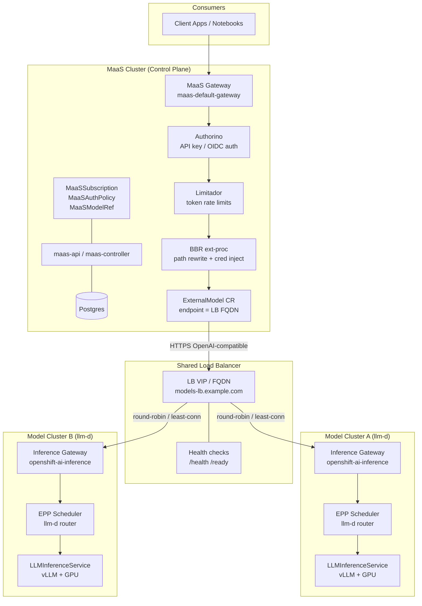
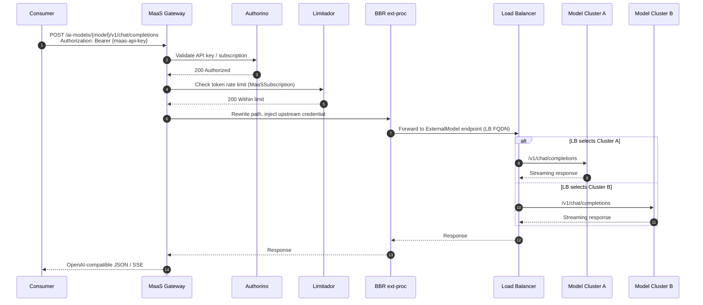
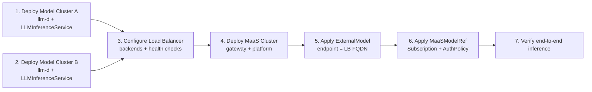

# MaaS Multi-Cluster Architecture

This document describes a **three-cluster topology**: one **MaaS control-plane cluster** that exposes a unified API to consumers, and two **model clusters** where inference workloads run on **llm-d** (LLMInferenceService + vLLM). A shared **load balancer** sits in front of the model clusters and is registered on the MaaS cluster as an `ExternalModel` endpoint.

## Overview

| Cluster | Role | Key stack |
|---------|------|-----------|
| **MaaS Cluster** | API gateway, auth, rate limits, catalog, subscriptions | RHOAI MaaS, RHCL/Kuadrant, Authorino, Limitador, Postgres |
| **Model Cluster A** | GPU inference (primary) | RHOAI, llm-d, LLMInferenceService, inference gateway |
| **Model Cluster B** | GPU inference (secondary / scale-out) | RHOAI, llm-d, LLMInferenceService, inference gateway |
| **Load Balancer** | Cross-cluster traffic distribution | HAProxy / F5 / cloud LB / MetalLB + Route |

Consumers never talk to the model clusters directly. They use a single MaaS gateway hostname; MaaS governance applies before traffic leaves the MaaS cluster toward the load balancer.

## High-Level Topology



## Inference Request Flow



## Cluster Responsibilities

### MaaS Cluster

Hosts the full MaaS platform (see `rhoai3/maas/` overlays). No GPU inference pods run here in this topology.

| Component | Namespace | Purpose |
|-----------|-----------|---------|
| `maas-default-gateway` | `openshift-ingress` | Single entry point for consumers |
| `maas-api`, `maas-controller` | `redhat-ods-applications` | API keys, model catalog, subscriptions |
| Authorino | `kuadrant-system` | Authentication and authorization |
| Limitador / Kuadrant | `kuadrant-system` | Rate limiting and policy enforcement |
| Postgres | `ai-models` (or dedicated) | MaaS metadata persistence |
| `ExternalModel` | `ai-models` | Points to LB FQDN; BBR routes outbound |
| `MaaSModelRef` | `ai-models` | Registers external model in catalog |
| `MaaSSubscription` | `models-as-a-service` | Token limits per tier |

Deploy with:

```bash
cd rhoai3 && ./maas/maas-script.sh   # overlays 01–11
```

### Model Clusters A & B

Each cluster runs an identical llm-d stack (see `rhoai3/llm-d/`). Models are deployed independently per cluster; the load balancer provides active/active or active/passive distribution.

| Component | Namespace | Purpose |
|-----------|-----------|---------|
| RHOAI DataScienceCluster | `redhat-ods-applications` | Platform operator + serving |
| `openshift-ai-inference` Gateway | `openshift-ingress` | Cluster-local inference ingress |
| EPP (Endpoint Picker) | per `LLMInferenceService` | llm-d scheduling (queue, KV-cache scorers) |
| `LLMInferenceService` | `demo-llm` | vLLM workload on GPU nodes |
| Hardware profile | `redhat-ods-applications` | GPU resource binding |

Deploy per cluster with:

```bash
cd rhoai3 && ./llm-d/llmd-script.sh   # overlays 01–08
```

Both clusters should expose the **same model ID** (e.g. `Qwen/Qwen3-0.6B`) so MaaS catalog entries and client requests stay consistent regardless of which backend serves the call.

### Load Balancer

The load balancer is the **only** address the MaaS cluster needs for remote inference. It terminates or passes TLS and distributes requests across the two model cluster inference gateways.

| Concern | Recommendation |
|---------|----------------|
| Backend targets | Inference gateway hostname or Route per model cluster |
| Algorithm | Round-robin or least-connections for active/active |
| Health checks | `GET /health` and `GET /ready` on the llm-d workload |
| TLS | Terminate at LB or pass-through to cluster gateways |
| Sticky sessions | Optional; llm-d EPP handles in-cluster scheduling |

Example backend pool:

```
models-lb.example.com
  ├── cluster-a: inference-gateway.apps.cluster-a.example.com:443
  └── cluster-b: inference-gateway.apps.cluster-b.example.com:443
```

## Wiring MaaS to the Load Balancer

On the **MaaS cluster**, register the LB as an external model. The manifests under `rhoai3/maas/base/instances/external-ai-models/` follow this pattern:

```yaml
apiVersion: maas.opendatahub.io/v1alpha1
kind: ExternalModel
metadata:
  name: qwen-multi-cluster
  namespace: ai-models
spec:
  provider: openai
  endpoint: "models-lb.example.com"      # LB FQDN only, no trailing slash
  targetModel: "Qwen/Qwen3-0.6B"           # must match llm-d model name
  credentialRef:
    name: external-model-credentials
```

The credential secret must carry the label `inference.networking.k8s.io/bbr-managed: "true"` so the BBR ext-proc injects the upstream API key:

```yaml
apiVersion: v1
kind: Secret
metadata:
  name: external-model-credentials
  namespace: ai-models
  labels:
    inference.networking.k8s.io/bbr-managed: "true"
stringData:
  api-key: "<shared-key-accepted-by-both-clusters>"
```

Then register governance resources:

- `MaaSModelRef` — adds the model to `/v1/models` and `/maas-api/v1/models`
- `MaaSAuthPolicy` — grants user/group access
- `MaaSSubscription` — sets token rate limits

Apply overlay `08-external-models` after updating endpoint and credentials.

## End-to-End Test Path

From a workstation (after MaaS gateway port-forward or direct Route access):

```bash
export GATEWAY_HOST="maas.apps.cluster-maas.example.com"
export HOST="https://${GATEWAY_HOST}"

# List models (includes external multi-cluster model)
curl -sS -H "Authorization: Bearer $(oc whoami -t)" \
  "${HOST}/v1/models" | jq .

# Create MaaS API key
API_KEY=$(curl -sS -H "Authorization: Bearer $(oc whoami -t)" \
  -H "Content-Type: application/json" -X POST \
  -d '{"name": "multi-cluster-key", "expiration": "1h"}' \
  "${HOST}/maas-api/v1/api-keys" | jq -r .key)

# Inference via MaaS → LB → llm-d cluster
curl -sS -H "Authorization: Bearer ${API_KEY}" \
  -H "Content-Type: application/json" \
  -d '{"model":"Qwen/Qwen3-0.6B","messages":[{"role":"user","content":"Hello"}]}' \
  "${HOST}/ai-models/qwen-multi-cluster/v1/chat/completions" | jq .
```

## Deployment Order



## Design Notes

**Why ExternalModel instead of in-cluster LLMInferenceService on MaaS?**  
`LLMInferenceService` with a gateway ref only works within a single OpenShift cluster. For models on separate clusters, MaaS treats the LB-backed endpoint as an OpenAI-compatible external provider via `ExternalModel` and BBR.

**Observability**  
MaaS usage metrics (Authorino hits, Limitador counters) stay on the MaaS cluster (overlay `11-maas-telemetry` — Tenant-managed telemetry). Per-cluster llm-d metrics remain on each model cluster's monitoring stack. Correlate by request ID / trace context if distributed tracing is enabled.

**Failure modes**

| Failure | Behavior |
|---------|----------|
| One model cluster down | LB health check removes backend; traffic served by surviving cluster |
| LB unreachable | MaaS returns 502/503 to consumers; in-cluster models unaffected |
| MaaS gateway down | All consumer access blocked; model clusters keep running |
| Rate limit exceeded | Limitador rejects at MaaS gateway before LB is contacted |

**Scaling**  
Add model clusters by registering additional LB backends. No MaaS CR changes are required unless you introduce a new model ID or subscription tier.

## Related Paths

| Path | Description |
|------|-------------|
| `rhoai3/maas/` | MaaS kustomize overlays and deploy script |
| `rhoai3/llm-d/` | llm-d model cluster kustomize overlays |
| `rhoai3/maas/base/instances/external-ai-models/` | ExternalModel, credentials, MaaSModelRef |
| `rhoai-maas-guide/content/modules/ROOT/pages/08-external-models.adoc` | External model governance details |
