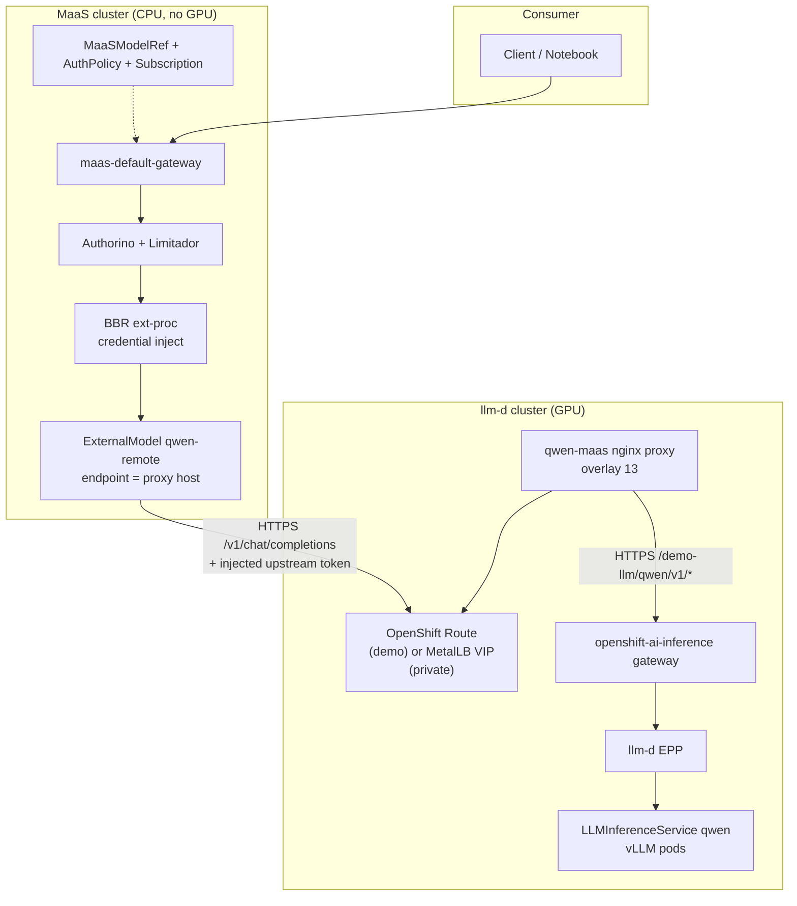
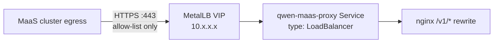
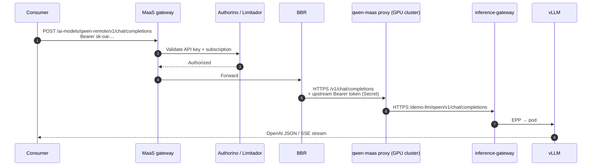

# Multi-Cluster MaaS + Remote llm-d

Deploy **MaaS on a non-GPU (CPU) cluster** and **llm-d inference on a separate GPU cluster**. Consumers use a single MaaS gateway; remote models are registered via `ExternalModel` and reached over HTTPS from the MaaS cluster.

For HA topologies with a shared load balancer across multiple GPU clusters, see [maas.md](maas.md).

## Cluster roles

| Cluster | GPU | Role | Overlays / scripts |
|---------|-----|------|-------------------|
| **MaaS (control plane)** | No | Gateway, API keys, auth, rate limits, catalog | `maas/overlays/01–11`, `12-external-cluster-llminference` |
| **llm-d (model)** | Yes | `LLMInferenceService`, vLLM, inference gateway, path-rewrite proxy | `llm-d/llmd-script.sh`, `maas/overlays/13-reverse-proxy-llminference` |

Consumers never call the GPU cluster directly. They use `https://maas.<maas-domain>/ai-models/<model>/v1/...`.

---

## Architecture (PoC — two clusters)



---

## Why a reverse proxy on the GPU cluster?

llm-d exposes models at a **namespaced path** on the inference gateway:

```text
https://inference-gateway.<gpu-domain>/demo-llm/qwen/v1/chat/completions
```

MaaS `ExternalModel` (BBR, `provider: openai`) calls the upstream at **host root**:

```text
https://<endpoint>/v1/chat/completions
```

Overlay **13** (`reverse-proxy-llminference`) runs nginx on the GPU cluster and rewrites:

```text
/v1/*  →  inference-gateway/<namespace>/<model>/v1/*
```

That gives BBR the root `/v1/` path it expects without changing `LLMInferenceService` routing.

---

## Exposure modes (demo vs production)

### Demo — OpenShift Route (default in overlay 13)

| Item | Value |
|------|--------|
| Host | `qwen-maas.<gpu-cluster-domain>` |
| Manifest | `base/instances/reverse-proxy-llminference/route.yaml` |
| TLS | Edge termination on cluster ingress |
| Use case | Labs, Wells Fargo PoC, quick cross-cluster tests |

**Pros:** DNS + TLS out of the box; easy `curl` verification.  
**Cons:** Publicly reachable if cluster ingress is on the internet; restrict with firewall or cluster policy in real environments.

### Production — MetalLB internal LoadBalancer (recommended)

Replace (or supplement) the public Route with a **private LoadBalancer IP** reachable only from the MaaS cluster network (VPC peering, VPN, or restricted firewall rules).



| Item | Demo (Route) | Production (MetalLB) |
|------|--------------|----------------------|
| `ExternalModel.endpoint` | `qwen-maas.apps.<gpu-domain>` | MetalLB VIP or private DNS `qwen-maas.internal.example.com` |
| Reachability | Internet / sandbox DNS | MaaS cluster CIDR only |
| TLS | Ingress cert | Private CA or passthrough to nginx |
| Manifest change | `route.yaml` as-is | Service `type: LoadBalancer` + MetalLB pool; omit or restrict Route |

Example Service patch (conceptual — not in repo by default):

```yaml
apiVersion: v1
kind: Service
metadata:
  name: qwen-maas-proxy
  namespace: qwen-maas-proxy
  annotations:
    metallb.universe.tf/address-pool: internal-pool
spec:
  type: LoadBalancer
  loadBalancerIP: 10.0.50.100   # optional static IP from internal pool
  selector:
    app: qwen-maas-proxy
  ports:
    - name: https
      port: 443
      targetPort: 8443            # nginx TLS on proxy, if terminated at proxy
```

Point `ExternalModel.spec.endpoint` at the **VIP or private DNS name** (hostname only, no `https://`).

---

## Request flow (end to end)



---

## Deployment order

### Phase A — GPU cluster (llm-d)

1. Deploy llm-d stack and model ([`llm-d/llmd-script.sh`](../../llm-d/llmd-script.sh)).
2. Confirm inference gateway works with prefix path:

   ```bash
   GATEWAY_URL="https://inference-gateway.${DOMAIN}/demo-llm/qwen"
   curl -sS "${GATEWAY_URL}/v1/models" -H "Authorization: Bearer ${TEST_TOKEN}"
   ```

3. **Update placeholders** in:
   - `base/instances/reverse-proxy-llminference/configmap-nginx.yaml` (`<cluster-domain>`, `<llm-namespace>`, `<llm-name>`)
   - `base/instances/reverse-proxy-llminference/route.yaml` (`<cluster-domain>`) — skip or adapt for MetalLB-only

4. Apply reverse proxy (overlay **13**):

   ```bash
   DOMAIN=$(oc get ingresses.config cluster -o jsonpath='{.spec.domain}')
   UPSTREAM_HOST="inference-gateway.${DOMAIN}"
   PROXY_HOST="qwen-maas.${DOMAIN}"

   oc apply -k ./maas/overlays/13-reverse-proxy-llminference/
   oc rollout status deployment/qwen-maas-proxy -n qwen-maas-proxy --timeout=120s
   ```

5. Verify proxy (must be **200** before MaaS registration):

   ```bash
   export TEST_TOKEN="$(oc create token test-user -n demo-llm)"

   curl -sS -w "\nHTTP:%{http_code}\n" \
     "https://${PROXY_HOST}/v1/chat/completions" \
     -H "Authorization: Bearer ${TEST_TOKEN}" \
     -H "Content-Type: application/json" \
     -d '{"model":"Qwen/Qwen3-0.6B","messages":[{"role":"user","content":"What is the capital of France?"}]}'
   ```

### Phase B — MaaS cluster (CPU)

1. Deploy MaaS platform (`maas-script.sh` overlays 01–11).
2. Create upstream credential Secret (token from GPU cluster `test-user` in `demo-llm`):

   ```bash
   oc create secret generic qwen-remote-credentials -n ai-models \
     --from-literal=api-key="${TEST_TOKEN}" --dry-run=client -o yaml | oc apply -f -
   oc label secret qwen-remote-credentials -n ai-models \
     inference.networking.k8s.io/bbr-managed=true --overwrite
   ```

3. Update `base/instances/external-cluster-llminference/qwen-remote-external-model.yaml`:
   - `spec.endpoint` = `PROXY_HOST` (Route hostname or MetalLB private DNS)

4. Apply overlay **12**:

   ```bash
   oc apply -k ./maas/overlays/12-external-cluster-llminference/
   ```

5. Verify from MaaS cluster:

   ```bash
   MAAS_HOST="maas.$(oc get ingresses.config cluster -o jsonpath='{.spec.domain}')"

   API_KEY=$(curl -sS -H "Authorization: Bearer $(oc whoami -t)" \
     -H "Content-Type: application/json" -X POST \
     -d '{"name":"qwen-remote-test","expiration":"1h"}' \
     "https://${MAAS_HOST}/maas-api/v1/api-keys" | jq -r .key)

   curl -sS "https://${MAAS_HOST}/ai-models/qwen-remote/v1/chat/completions" \
     -H "Authorization: Bearer ${API_KEY}" \
     -H "Content-Type: application/json" \
     -d '{"model":"Qwen/Qwen3-0.6B","messages":[{"role":"user","content":"What is the capital of France?"}]}' | jq .
   ```

---

## Kustomize layout

| Overlay | Cluster | Purpose |
|---------|---------|---------|
| [`13-reverse-proxy-llminference`](../overlays/13-reverse-proxy-llminference/) | GPU (llm-d) | nginx: `/v1/*` → inference gateway prefixed path |
| [`12-external-cluster-llminference`](../overlays/12-external-cluster-llminference/) | MaaS (CPU) | `ExternalModel`, `MaaSModelRef`, auth + subscription for `qwen-remote` |

Base manifests:

```text
maas/base/instances/reverse-proxy-llminference/
  namespace.yaml, configmap-nginx.yaml, deployment.yaml, service.yaml, route.yaml

maas/base/instances/external-cluster-llminference/
  qwen-remote-external-model.yaml, qwen-remote-maasmodelref.yaml
  maasauthpolicy-free.yaml, maassubscription-free.yaml
  qwen-remote-credentials.yaml   # template; create Secret imperatively
```

---

## URL reference

| Caller | URL |
|--------|-----|
| Direct llm-d gateway | `https://inference-gateway.<gpu-domain>/demo-llm/qwen/v1/chat/completions` |
| Reverse proxy (BBR target) | `https://qwen-maas.<gpu-domain>/v1/chat/completions` |
| MaaS consumer | `https://maas.<maas-domain>/ai-models/qwen-remote/v1/chat/completions` |

---

## Troubleshooting

| Symptom | Likely cause | Check |
|---------|--------------|--------|
| **403** + `x-ext-auth-reason: Unauthorized` | `qwen-remote` missing from `MaaSAuthPolicy` / `MaaSSubscription` | `oc get maasauthpolicy, maassubscription -n models-as-a-service -o yaml` |
| **404** from MaaS | BBR hits `/v1/` but proxy not deployed or wrong host | `curl` proxy URL from MaaS network; overlay 13 |
| **401** upstream | Bad or expired token in `qwen-remote-credentials` | Recreate Secret with fresh `test-user` token |
| Empty `curl` body | HTTP error without JSON | `curl -w "\nHTTP:%{http_code}\n"` or `-v` |
| BBR not injecting creds | Known ext-proc filter mismatch ([RHOAIENG-68594](https://redhat.atlassian.net/browse/RHOAIENG-68594)) | `oc get envoyfilter payload-processing -n openshift-ingress` |
| MaaS cannot reach GPU | Firewall / no peering | `curl` from MaaS cluster to `PROXY_HOST` |

---

## Security checklist (production)

- [ ] Use MetalLB **internal** pool; no public Route to inference proxy
- [ ] Firewall: allow **only MaaS cluster egress** → proxy VIP:443
- [ ] Rotate upstream token in `qwen-remote-credentials` regularly
- [ ] Consumers use **MaaS API keys** only; never GPU cluster tokens
- [ ] NetworkPolicy on `qwen-maas-proxy` namespace (optional)
- [ ] Streaming: disable proxy buffering (already set in nginx ConfigMap)

---

## Related docs

- [maas.md](maas.md) — three-cluster topology with shared LB and HA
- [../README.md](../README.md) — MaaS control-plane deployment
- [../../llm-d/README.md](../../llm-d/README.md) — llm-d GPU cluster deployment
- [maas-script.sh](../maas-script.sh) — phased runbook including overlays 12–13
